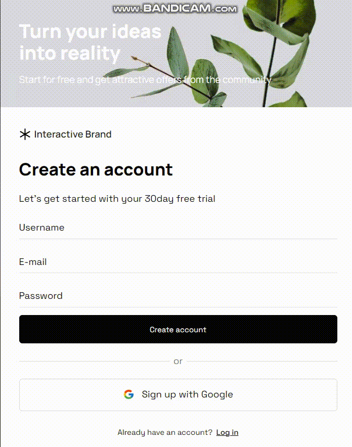

<h2 align="center">Hello, World! </h2>

<h1 align="center">I'm Iuliia, frontend developer</h1>

<h3 align="center">My skills:<h3>
<table width="320px">
    <tbody>
        <tr valign="top">
            <td width="80px" align="center">
            <strong>HTML</strong> 
            
            </td>
            <td width="80px" align="center">
            <strong>CSS</strong> 
            
            </td>
            <td width="80px" align="center">
            <strong>Sass</strong> 
            
            </td>
            <td width="80px" align="center"><strong>Bootstrap</strong> 
            
            </td>
            <td width="80px" align="center">
            <strong>VS Code</strong> 
            
            </td>
            <td width="80px" align="center">
            <strong>JS</strong> 
            
            </td>
            <td width="80px" align="center">
            <strong>React</strong> 
            
            </td>
            <td width="80px" align="center">
            <strong>npm</strong> 
            
            </td>
            <td width="80px" align="center">
            <strong>GitHub</strong> 
            
            <td width="80px" align="center">
            <strong>Git</strong> 
            
            </td> 
        </tr>
    </tbody>
</table>

<h3>In this project - Responsive Create account page, from FIGMA to HTML CSS JS with one breakpoint</h3>
<h4>Thanks to Evgeny Andrikanich</h4>

This site is live at  https://iuliia-bogdanova.github.io/create-account-page/
